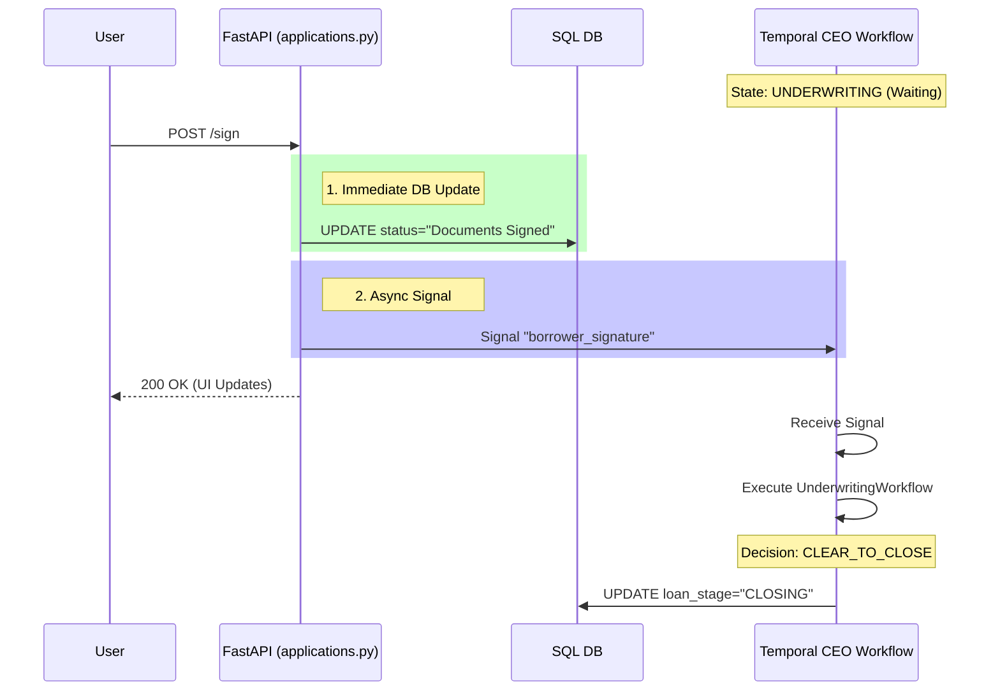

# System Architecture Document

## Overview
The Loan Origination System (LOS) follows a **Pyramid Architecture**, designed to decouple the frontend, backend, and orchestration layers.

*   **Frontend (React):** Read-only view of the state, triggered by user actions.
*   **Backend (FastAPI):** Handling HTTP requests, updating the SQL "System of Record" immediately for UI responsiveness, and signaling the Orchestrator.
*   **Orchestration (Temporal):** The "CEO" workflow (`LoanLifecycleWorkflow`) functions as a state machine, managing long-running processes and delegating work to "Department Manager" workflows.

---

## Life of a Loan: Phase Breakdown

### 1. Phase: Applied (Lead Capture)
The user submits a new application. The system initializes the record and starts the orchestration.

| Component | Action / State Change |
| :--- | :--- |
| **Trigger** | User submits form on `/apply` page. |
| **API Endpoint** | `POST /api/routes/applications/apply` |
| **Database Update** | `INSERT INTO application ... loan_stage = 'LEAD_CAPTURE', status = 'Submitted'` |
| **Temporal Action** | `client.start_workflow(LoanLifecycleWorkflow)` |
| **Workflow Transition** | **CEO Workflow** starts -> Executes `LeadCaptureWorkflow` (Child). |
| **UI State Change** | Progress Stepper: **"Applied"** (Step 1). |

### 2. Phase: AI Review (Analysis)
The system automatically analyzes the uploaded documents.

| Component | Action / State Change |
| :--- | :--- |
| **Trigger** | `LeadCaptureWorkflow` execution. |
| **API Endpoint** | N/A (Internal Verification). |
| **Database Update** | `UPDATE application SET loan_metadata = {...analysis_results}` |
| **Temporal Action** | Activity: `analyze_document`, `update_loan_metadata`. |
| **Workflow Transition** | `LeadCaptureWorkflow` returns `AI Recommendation`. CEO waits for **Human Gate**. |
| **UI State Change** | Progress Stepper: **"AI Review"** (Step 2 active). Action Card may show "Pending Review". |

### 3. Phase: Manager Review (Processing)
A human manager reviews the AI's findings and approves the loan.

| Component | Action / State Change |
| :--- | :--- |
| **Trigger** | Manager clicks "Approve" on Dashboard. |
| **API Endpoint** | `POST /review` |
| **Database Update** | `UPDATE application SET loan_stage = 'PROCESSING', status = 'Approved by Manager'` |
| **Temporal Signal** | `Signal: human_approval` (Payload: `True`) |
| **Workflow Transition** | CEO receives signal -> Executes `ProcessingWorkflow` (Child) -> Moves to `UNDERWRITING`. |
| **UI State Change** | Progress Stepper: **"Manager Review"** (Step 3). Status Badge: **"Approved"**. |

### 4. Phase: Signing (Underwriting Preparation)
The processing phase generates disclosures, and the system waits for the borrower to sign.

**Note:** In the current logical flow, the "Waiting for Signature" state acts as the gate *into* the distinct Underwriting calculations.

| Component | Action / State Change |
| :--- | :--- |
| **Trigger** | User clicks "Sign Documents Now". |
| **API Endpoint** | `POST /applications/{id}/sign` |
| **Database Update** | `UPDATE application SET status = 'Documents Signed'` |
| **Temporal Signal** | `Signal: borrower_signature` (Payload: `True`) |
| **Workflow Transition** | CEO receives signal -> Executes `UnderwritingWorkflow`. |
| **UI State Change** | Action Card disappears -> "View Signed Copy" appears. |

### 5. Phase: Funded (Closing & Archive)
The system finalizes the loan if underwriting clears.

| Component | Action / State Change |
| :--- | :--- |
| **Trigger** | `UnderwritingWorkflow` returns `CLEAR_TO_CLOSE`. |
| **API Endpoint** | N/A (Automated Transition). |
| **Database Update** | `UPDATE application SET loan_stage = 'CLOSING' ... then 'ARCHIVED'` |
| **Temporal Action** | Activity: `update_loan_metadata` (Final Status). |
| **Workflow Transition** | CEO completes -> Workflow Status: `COMPLETED`. |
| **UI State Change** | Progress Stepper: **"Funded"** (Final Step). Status Badge: **"Completed"**. |

---

## Data Flow Diagram: The Signature Loop



---

## Magic Strings Dictionary

The system relies on specific string values to coordinate state between the DB, UI, and Workflow.

| Context | String Value | Used In |
| :--- | :--- | :--- |
| **Status** | `Submitted` | Initial application state. |
| **Status** | `Failed to Start` | Workflow init failure. |
| **Status** | `Approved by Manager` | Manager Review Action. |
| **Status** | `Rejected by Manager` | Manager Review Action. |
| **Status** | `Waiting for Signature` | Set by Workflow before waiting for signal. |
| **Status** | `Documents Signed` | Set by API after signing. |
| **Stage** | `LEAD_CAPTURE` | Initial Stage. |
| **Stage** | `PROCESSING` | After Manager Approval. |
| **Stage** | `UNDERWRITING` | Waiting for Sig & Active Underwriting. |
| **Stage** | `CLOSING` | Post-Underwriting Success. |
| **Stage** | `ARCHIVED` | Final Terminal State. |
| **Signal** | `human_approval` | `ceo.py` / `applications.py` |
| **Signal** | `update_field` | `ceo.py` / `applications.py` |
| **Signal** | `borrower_signature` | `ceo.py` / `applications.py` |

---

## The "Disconnected" Logic Analysis

### The Problem
In `backend/app/api/routes/applications.py` (Line 470), the `sign_documents` endpoint prematurely advances the `loan_stage`:

```python
# CURRENT CODE (applications.py)
app_record.status = "Documents Signed"
app_record.loan_stage = LoanStage.CLOSING.value  # <--- PREMATURE JUMP
```

**Why this is an issue:**
1.  The **CEO Workflow** is actually in the `UNDERWRITING` stage (Line 213 in `ceo.py`) while waiting for the signature.
2.  Once the signature is received, the CEO Workflow executes the `UnderwritingWorkflow`.
3.  By setting the DB stage to `CLOSING` immediately in the API, the Frontend (which reads from DB) thinks the **Underwriting Phase** is already finished.
4.  Consequently, the UI Progress Bar will jump straight from "Sign Docs" to "Underwriting" (Completed) or "Funded", visually skipping the "Active Underwriting" calculation step that is actually happening in the background.

### Proposed Code Fix

We must allow the **CEO Workflow** to drive the transition to `CLOSING` *after* the `UnderwritingWorkflow` has actually finished (see `ceo.py` lines 275-277).

**Update `backend/app/api/routes/applications.py`:**

```python
# PROPOSED FIX
# Remove the line that sets loan_stage to CLOSING
# Optionally ensure it remains in UNDERWRITING to match the workflow expectation

if app_record:
    app_record.status = "Documents Signed"
    # app_record.loan_stage = LoanStage.CLOSING.value  <-- DELETE THIS LINE
    # The workflow is responsible for moving to CLOSING after Underwriting checks pass.
    
    session.add(app_record)
    session.commit()
```
