# 📘 Canonical Model & Schema Documentation

## Utility MCP Server - Mortgage Document Processing System

---

## Table of Contents

1. [Overview](#overview)
2. [Canonical Model Architecture](#canonical-model-architecture)
3. [Canonical Schema Structure](#canonical-schema-structure)
4. [Document-Specific Mapping System](#document-specific-mapping-system)
5. [Canonical Mapper Implementation](#canonical-mapper-implementation)
6. [Pipeline Flow](#pipeline-flow)
7. [Document Scoping Rules](#document-scoping-rules)
8. [Priority-Based Field Mapping](#priority-based-field-mapping)
9. [List Pattern Mapping](#list-pattern-mapping)
10. [Normalization Layer](#normalization-layer)
11. [Examples](#examples)

---

## Overview

The **Canonical Model** is the heart of the Utility MCP Server's data transformation pipeline. It provides a **unified, MISMO-compatible schema** that standardizes mortgage document data regardless of the source document type.

### Key Principles

1. **Deterministic Mapping**: NO LLM usage in canonical mapping - pure rule-based logic
2. **Document Scoping**: Each document type only populates relevant schema sections
3. **Partial Schema Output**: Only populated fields are included (no empty initialization)
4. **Priority-Based Selection**: Multiple source fields can map to one target with fallback priority
5. **MISMO Alignment**: Schema designed for future MISMO XML generation

---

## Canonical Model Architecture

```mermaid
flowchart TB
    subgraph Input["📥 Input Layer"]
        A1[URLA Form]
        A2[Bank Statement]
        A3[Pay Stub]
        A4[Government ID]
        A5[Other Documents]
    end
    
    subgraph Extraction["🔍 Extraction Layer"]
        B1[Classifier]
        B2[docTR OCR]
        B3[Dockling Parser]
        B4[Structure Extractor LLM]
    end
    
    subgraph Mapping["🗺️ Mapping Layer"]
        C1[Document Type Detection]
        C2[Load Mapping Rules]
        C3[Apply Scoping Rules]
        C4[Priority-Based Mapping]
        C5[Canonical Mapper]
    end
    
    subgraph Schema["📋 Canonical Schema"]
        D1[deal]
        D2[loan]
        D3[parties]
        D4[employment]
        D5[financials]
        D6[collateral]
        D7[transaction]
        D8[borrower]
        D9[governmentLoans]
        D10[closing]
    end
    
    subgraph Output["📤 Output Layer"]
        E1[Normalized JSON]
        E2[MISMO XML Future]
    end
    
    Input --> Extraction
    Extraction --> Mapping
    Mapping --> Schema
    Schema --> Output
```



---

## Canonical Schema Structure

The canonical schema is located at:
```
resources/canonical_schema/schema.json
```

### Schema Version: 2.0.0

### Top-Level Sections

#### 1. **transaction** (Bank Statements)
```json
{
  "transaction": {
    "assets": [
      {
        "institutionName": "",
        "accountNumberMasked": "",
        "currentBalance": 0,
        "accountType": ""
      }
    ],
    "list": [
      {
        "date": "",
        "description": "",
        "amount": 0
      }
    ]
  }
}
```

**Purpose**: Captures bank account information and transaction history from bank statements.

---

#### 2. **borrower** (Bank Statements, Identity Documents)
```json
{
  "borrower": [
    {
      "firstName": "",
      "lastName": "",
      "address": {
        "street": "",
        "city": "",
        "state": "",
        "zipCode": "",
        "country": ""
      }
    }
  ]
}
```

**Purpose**: Simplified borrower information from non-application documents.

---

#### 3. **deal** (URLA)
```json
{
  "deal": {
    "dealId": "",
    "applicationDate": "",
    "loanPurpose": "",
    "dealStatus": "InProgress",
    "documentsProvided": [
      {
        "documentType": "",
        "documentId": "",
        "receivedDate": "",
        "confidence": 0.0
      }
    ]
  }
}
```

**Purpose**: High-level deal/application metadata.

---

#### 4. **loan** (URLA)
```json
{
  "loan": {
    "loanAmount": 0,
    "loanTermMonths": 0,
    "interestRate": 0.0,
    "loanPurpose": "Purchase",
    "mortgageType": "Conventional",
    "loanProgram": "",
    "amortizationType": "Fixed",
    "downPaymentAmount": 0,
    "firstPaymentDate": ""
  }
}
```

**Purpose**: Loan-specific details from mortgage applications.

---

#### 5. **parties** (URLA, Government ID)
```json
{
  "parties": [
    {
      "partyId": "",
      "role": "Borrower",
      "taxpayerIdentifier": {
        "type": "SSN",
        "value": ""
      },
      "individual": {
        "firstName": "",
        "lastName": "",
        "dateOfBirth": "",
        "maritalStatus": "",
        "citizenshipStatus": ""
      },
      "contact": {
        "phone": "",
        "email": ""
      },
      "currentAddress": {
        "street": "",
        "city": "",
        "state": "",
        "zipCode": "",
        "country": "US"
      }
    }
  ]
}
```

**Purpose**: Detailed party information (borrowers, co-borrowers) with full identity data.

---

#### 6. **employment** (URLA, Pay Stubs)
```json
{
  "employment": [
    {
      "partyId": "",
      "employerName": "",
      "employmentType": "FullTime",
      "startDate": "",
      "endDate": "",
      "selfEmployed": false
    }
  ]
}
```

**Purpose**: Employment history and current employment status.

---

#### 7. **financials** (URLA, Pay Stubs, Bank Statements, Tax Returns)
```json
{
  "financials": {
    "incomes": [
      {
        "partyId": "",
        "incomeType": "Base",
        "amount": 0,
        "frequency": "Monthly",
        "sourceDocument": "PayStub"
      }
    ],
    "assets": [
      {
        "partyId": "",
        "assetType": "Checking",
        "institutionName": "",
        "accountNumberMasked": "",
        "currentBalance": 0,
        "averageBalance": 0,
        "sourceDocument": "BankStatement"
      }
    ],
    "liabilities": [
      {
        "partyId": "",
        "liabilityType": "CreditCard",
        "creditorName": "",
        "monthlyPayment": 0,
        "remainingBalance": 0
      }
    ]
  }
}
```

**Purpose**: Comprehensive financial picture including income, assets, and liabilities.

---

#### 8. **collateral** (URLA, Sales Contract, Property Appraisal)
```json
{
  "collateral": {
    "propertyAddress": {
      "street": "",
      "city": "",
      "state": "",
      "zipCode": ""
    },
    "propertyValue": 0
  }
}
```

**Purpose**: Property/collateral information for the loan.

---

#### 9. **governmentLoans** (URLA, VA Forms)
```json
{
  "governmentLoans": {
    "va": {
      "coeNumber": "",
      "eligible": false
    }
  }
}
```

**Purpose**: Government-backed loan program details (VA, FHA, etc.).

---

#### 10. **closing** (URLA, Closing Disclosure)
```json
{
  "closing": {
    "closingDate": "",
    "monthlyPayment": 0,
    "cashToClose": 0
  }
}
```

**Purpose**: Closing-related financial information.

---

## Document-Specific Mapping System

### Mapping Rules Location
```
resources/canonical_mappings/
├── BankStatement.json
├── PayStub.json
├── URLA.json
├── GovernmentID.json
└── README.md
```

### Mapping Rule Format

Each mapping file contains an array of mapping rules:

```json
[
  {
    "sourceField": "fieldNameInExtractedData",
    "targetPath": "path.in.canonical.schema[0].field",
    "priority": 1
  }
]
```

#### Field Definitions

- **sourceField** (required): Field name from the extracted data (LLM output)
- **targetPath** (required): Dot-notation path in canonical schema
  - Supports nested objects: `financials.assets`
  - Supports array indexing: `financials.assets[0].institutionName`
- **priority** (optional): Lower number = higher priority (default: 999)
- **type** (optional): Special mapping type (e.g., "listPattern")

---

## Canonical Mapper Implementation

### Core Class: `CanonicalMapper`

Located at: `tools/canonical_mapper.py`

### Key Methods

#### 1. `map(document_type, extracted_fields)`
Main entry point for mapping.

```python
mapper = CanonicalMapper()
result = mapper.map("BankStatement", {
    "bankName": "Chase",
    "endingBalance": 10000
})
```

#### 2. `_load_mapping_rules(document_type)`
Loads document-specific mapping rules from JSON files.

#### 3. `_get_allowed_sections(document_type)`
Returns allowed canonical sections based on document type.

#### 4. `_is_path_allowed(target_path, allowed_sections)`
Validates that a target path is allowed for the document type.

#### 5. `_set_nested_value(obj, path, value)`
Sets values in nested dictionaries using dot notation with array support.

#### 6. `_apply_mapping(extracted_fields, mapping_rules, allowed_sections)`
Applies mapping rules with strict scoping and priority-based selection.

#### 7. `_validate_output(result, allowed_sections, document_type)`
Ensures output only contains allowed sections.

---

## Pipeline Flow

### Complete Document Processing Flow


### Step-by-Step Breakdown

#### **Step 1: Classification**
```python
classification = classify_document(file_path)
# Output:
{
  "file_type": "pdf",
  "pdf_type": "scanned",
  "document_category": "Bank Statement",
  "recommended_tool": "ocr_document",
  "confidence": 0.85,
  "reasoning": "..."
}
```

#### **Step 2: Raw Extraction**
```python
# If recommended_tool == "parse_document_with_dockling":
raw_text = extract_with_dockling(file_path)  # Returns markdown

# If recommended_tool == "ocr_document":
raw_text = extract_with_doctr(file_path)  # Returns plain text
```

#### **Step 3: Structure Extraction (LLM)**
```python
extracted_json_path = extract_structure(markdown_file, document_type)
# Saves to: {filename}_extracted.json

# Output format:
{
  "documentType": "BankStatement",
  "extractedFields": {
    "institutionName": "Bank of America, N.A.",
    "accountNumberMasked": "****5555",
    "currentBalance": 25000,
    "deposits_1_date": "2024-01-15",
    "deposits_1_amount": 5000,
    "deposits_1_description": "Direct Deposit"
  }
}
```

#### **Step 4: Canonical Mapping**
```python
canonical_output = map_to_canonical_model("BankStatement", extracted_fields)
# Output: Partial canonical JSON with ONLY allowed sections
{
  "transaction": {
    "assets": [{
      "institutionName": "Bank of America, N.A.",
      "accountNumberMasked": "****5555",
      "currentBalance": 25000
    }],
    "list": [{
      "date": "2024-01-15",
      "amount": 5000,
      "description": "Direct Deposit"
    }]
  },
  "borrower": [...]
}
```

#### **Step 5: Normalization**
```python
normalized_output = normalize_data(canonical_output)
# Currently a placeholder - future implementation will:
# - Convert dates to ISO-8601
# - Standardize currency formats
# - Apply controlled vocabularies
```

---

## Document Scoping Rules

### DOCUMENT_SCOPE Mapping

Located in: `tools/canonical_mapper.py`

```python
DOCUMENT_SCOPE = {
    "BankStatement": {"transaction", "borrower"},
    "PayStub": {"financials.incomes", "employment"},
    "W2": {"financials.incomes"},
    "URLA": {
        "deal", "loan", "parties", "employment", 
        "financials", "collateral", "governmentLoans", "closing"
    },
    "GovernmentID": {"parties"},
    "SalesContract": {"collateral"},
    "PropertyAppraisal": {"collateral"},
    "TaxReturn": {"financials.incomes"},
    "CreditReport": {"financials.liabilities"}
}
```

### Scoping Enforcement

**Rule**: A document can ONLY populate sections defined in its scope.

**Example**:
- ✅ BankStatement → `transaction`, `borrower` (ALLOWED)
- ❌ BankStatement → `loan`, `parties` (BLOCKED)

**Validation**: The mapper validates output and raises `ValueError` if disallowed sections are present.

---

## Priority-Based Field Mapping

### Why Priority Mapping?

Different documents may use different field names for the same data. Priority mapping provides fallback logic.

### Example: Bank Statement Institution Name

```json
[
  {
    "sourceField": "institutionName",
    "targetPath": "transaction.assets[0].institutionName",
    "priority": 1
  },
  {
    "sourceField": "bankName",
    "targetPath": "transaction.assets[0].institutionName",
    "priority": 2
  }
]
```

**Logic**:
1. Check if `institutionName` exists in extracted fields → Use it (priority 1)
2. If not found, check `bankName` → Use it (priority 2)
3. If neither found → Skip this field (no default values)

### Priority Rules

- **Lower number = Higher priority**
- **First match wins** (deterministic)
- **No default values** (enforcing data purity)

---

## List Pattern Mapping

### Purpose

Handle repeating data structures like transaction lists, multiple deposits/withdrawals.

### Format

Extracted fields use pattern: `{prefix}_{index}_{field}`

Example:
```json
{
  "deposits_1_date": "2024-01-15",
  "deposits_1_amount": 5000,
  "deposits_1_description": "Direct Deposit",
  "deposits_2_date": "2024-01-22",
  "deposits_2_amount": 3000,
  "deposits_2_description": "Transfer"
}
```

### Mapping Rule

```json
{
  "type": "listPattern",
  "targetPath": "transaction.list",
  "sourcePrefix": "deposits",
  "priority": 1,
  "itemMapping": {
    "amount": "amount",
    "date": "date",
    "description": "description"
  }
}
```

### Output

```json
{
  "transaction": {
    "list": [
      {
        "date": "2024-01-15",
        "amount": 5000,
        "description": "Direct Deposit"
      },
      {
        "date": "2024-01-22",
        "amount": 3000,
        "description": "Transfer"
      }
    ]
  }
}
```

---

## Normalization Layer

### Current Implementation

Located at: `tools/normalization.py`

```python
def normalize_data(data: dict) -> dict:
    logger.info("Normalizing data")
    # Placeholder: Ensure dates are ISO, currency is number, etc.
    return data
```

### Future Normalization Rules

1. **Date Normalization**
   - Input: `01/15/2024`, `Jan 15, 2024`, `2024-01-15`
   - Output: `2024-01-15` (ISO-8601)

2. **Currency Normalization**
   - Input: `$25,000.00`, `25000`, `25K`
   - Output: `25000` (numeric)

3. **Enumeration Normalization**
   - Input: `full time`, `Full-Time`, `FT`
   - Output: `FullTime` (controlled vocabulary)

4. **Phone Number Normalization**
   - Input: `(555) 123-4567`, `555-123-4567`
   - Output: `+15551234567` (E.164 format)

5. **SSN Masking**
   - Input: `123-45-6789`
   - Output: `***-**-6789`

---

## Examples

### Example 1: Bank Statement Processing

#### Input Document
```
Bank of America
Account Summary
Account Number: ****5555
Ending Balance: $25,000.00

Transactions:
01/15/2024  Direct Deposit    $5,000.00
01/22/2024  Transfer          $3,000.00
```

#### Extracted Fields (LLM Output)
```json
{
  "institutionName": "Bank of America, N.A.",
  "accountNumberMasked": "****5555",
  "currentBalance": 25000,
  "deposits_1_date": "01/15/2024",
  "deposits_1_amount": 5000,
  "deposits_1_description": "Direct Deposit",
  "deposits_2_date": "01/22/2024",
  "deposits_2_amount": 3000,
  "deposits_2_description": "Transfer"
}
```

#### Canonical Output
```json
{
  "transaction": {
    "assets": [
      {
        "institutionName": "Bank of America, N.A.",
        "accountNumberMasked": "****5555",
        "currentBalance": 25000
      }
    ],
    "list": [
      {
        "date": "01/15/2024",
        "amount": 5000,
        "description": "Direct Deposit"
      },
      {
        "date": "01/22/2024",
        "amount": 3000,
        "description": "Transfer"
      }
    ]
  }
}
```

---

### Example 2: Pay Stub Processing

#### Input Document
```
ABC Corporation
Pay Period: 01/01/2024 - 01/15/2024
Employee: John Doe

Earnings:
Base Pay: $5,000.00
YTD Gross: $60,000.00
Net Pay: $3,800.00
```

#### Extracted Fields
```json
{
  "employerName": "ABC Corporation",
  "payBeginDate": "01/01/2024",
  "totalEarningsCurrent": 5000,
  "totalEarningsYTD": 60000,
  "netPayCurrent": 3800,
  "incomeType": "Base"
}
```

#### Canonical Output
```json
{
  "employment": [
    {
      "employerName": "ABC Corporation",
      "startDate": "01/01/2024"
    }
  ],
  "financials": {
    "incomes": [
      {
        "amount": 5000,
        "incomeType": "Base"
      }
    ]
  }
}
```

**Note**: Only `employment` and `financials.incomes` sections are populated (per PayStub scoping rules).

---

### Example 3: URLA Form Processing

#### Input Document
```
Uniform Residential Loan Application (Form 1003)

Borrower Information:
Name: John Doe
SSN: 123-45-6789
DOB: 01/15/1980
Phone: (555) 123-4567
Email: john.doe@email.com

Loan Information:
Loan Amount: $350,000
Loan Purpose: Purchase
Interest Rate: 6.5%
Loan Term: 360 months
```

#### Extracted Fields
```json
{
  "borrowerFirstName": "John",
  "borrowerLastName": "Doe",
  "borrowerSSN": "123-45-6789",
  "borrowerDOB": "01/15/1980",
  "borrowerPhone": "(555) 123-4567",
  "borrowerEmail": "john.doe@email.com",
  "loanAmount": 350000,
  "loanPurpose": "Purchase",
  "interestRate": 6.5,
  "loanTermMonths": 360
}
```

#### Canonical Output
```json
{
  "deal": {
    "loanPurpose": "Purchase"
  },
  "loan": {
    "loanAmount": 350000,
    "loanPurpose": "Purchase",
    "interestRate": 6.5,
    "loanTermMonths": 360
  },
  "parties": [
    {
      "individual": {
        "firstName": "John",
        "lastName": "Doe",
        "dateOfBirth": "01/15/1980"
      },
      "taxpayerIdentifier": {
        "value": "123-45-6789"
      },
      "contact": {
        "phone": "(555) 123-4567",
        "email": "john.doe@email.com"
      }
    }
  ]
}
```

**Note**: URLA has access to ALL canonical sections, so multiple sections are populated.

---

## Key Design Decisions

### 1. **No LLM in Canonical Mapping**
**Why**: Ensures deterministic, auditable, and repeatable results. LLMs are only used for initial structure extraction, not for schema mapping.

### 2. **Partial Schema Output**
**Why**: Reduces noise, improves clarity, and prevents false data. Only relevant sections are populated.

### 3. **Document Scoping**
**Why**: Prevents schema pollution. A bank statement should never populate loan details.

### 4. **Priority-Based Mapping**
**Why**: Handles field name variations across different document formats and vendors.

### 5. **No Default Values**
**Why**: Maintains data purity. If a field isn't in the source document, it shouldn't be in the canonical output.

### 6. **Array Auto-Creation**
**Why**: Simplifies mapping logic. Arrays are created automatically when needed.

---

## Future Enhancements

### 1. **MISMO XML Generation**
- Convert canonical JSON to MISMO 3.4 XML format
- XSD validation against MISMO schemas
- Located at: `tools/mismo_placeholder.py` (currently placeholder)

### 2. **Data Dictionary Integration**
- Controlled vocabularies for enumerations
- Field-level validation rules
- Data type enforcement

### 3. **Multi-Document Aggregation**
- Merge data from multiple documents (e.g., multiple pay stubs)
- Conflict resolution strategies
- Data versioning

### 4. **Advanced Normalization**
- Implement all normalization rules
- Data quality scoring
- Anomaly detection

### 5. **Validation Layer**
- Business rule validation
- Cross-field validation
- Completeness scoring

---

## File Locations Reference

### Core Files
- **Canonical Schema**: `resources/canonical_schema/schema.json`
- **Canonical Mapper**: `tools/canonical_mapper.py`
- **Normalization**: `tools/normalization.py`

### Mapping Rules
- **BankStatement**: `resources/canonical_mappings/BankStatement.json`
- **PayStub**: `resources/canonical_mappings/PayStub.json`
- **URLA**: `resources/canonical_mappings/URLA.json`
- **GovernmentID**: `resources/canonical_mappings/GovernmentID.json`

### Pipeline Components
- **Classifier**: `tools/classifier.py`
- **docTR Tool**: `tools/doctr_tool.py`
- **Dockling Tool**: `tools/dockling_tool.py`
- **Structure Extractor**: `tools/structure_extractor.py`
- **Unified Extraction**: `tools/unified_extraction.py`
- **Pipeline Router**: `orchestrator/pipeline_router.py`

### Server
- **MCP Server**: `server.py`

### Testing
- **Pipeline Test**: `test_pipeline.py`
- **URLA Test**: `test_urla.py`
- **PayStub Test**: `test_paystub.py`

---

## Conclusion

The Canonical Model provides a **robust, deterministic, and scalable** approach to mortgage document data standardization. By separating concerns (extraction → structure → mapping → normalization), the system ensures:

- ✅ **Auditability**: Every transformation is traceable
- ✅ **Extensibility**: New document types can be added without code changes
- ✅ **MISMO Readiness**: Schema aligns with industry standards
- ✅ **Data Purity**: No hallucinations or default values
- ✅ **Production-Grade**: Designed for enterprise mortgage workflows

---

**Document Version**: 1.0  
**Last Updated**: 2026-02-03  
**Author**: Utility MCP Server Team
