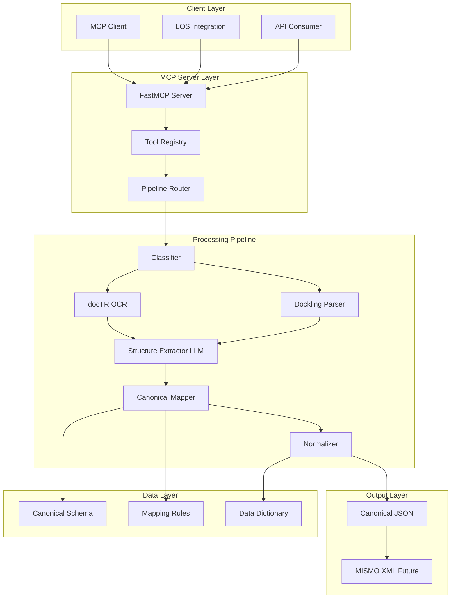
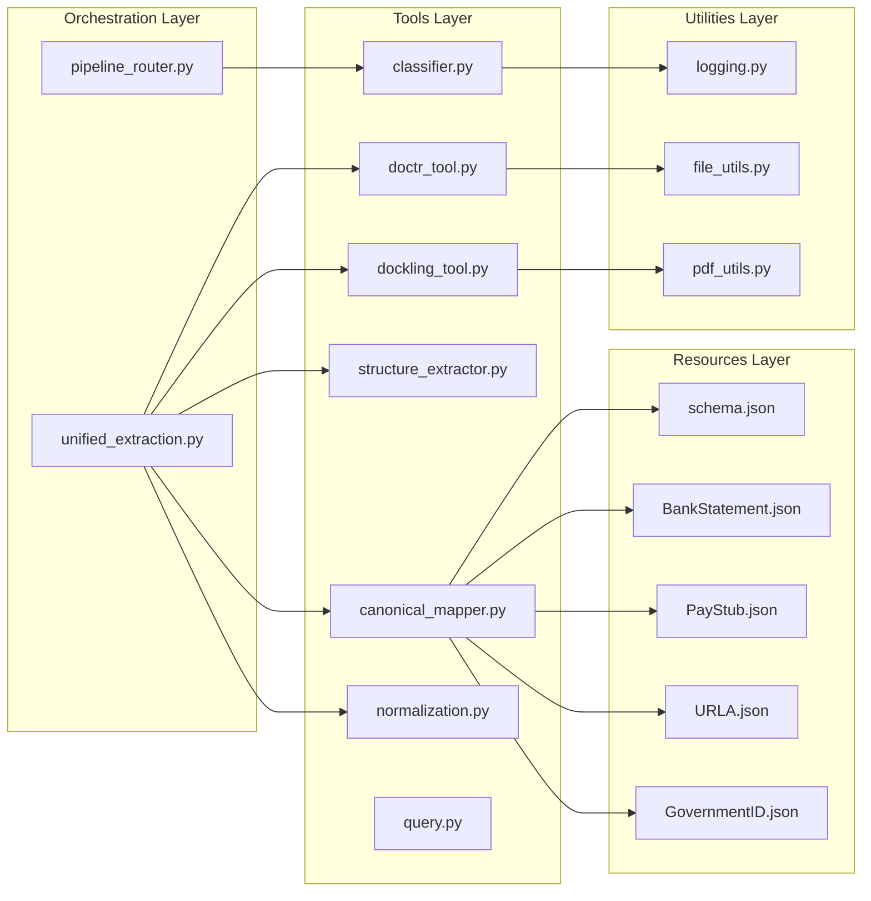
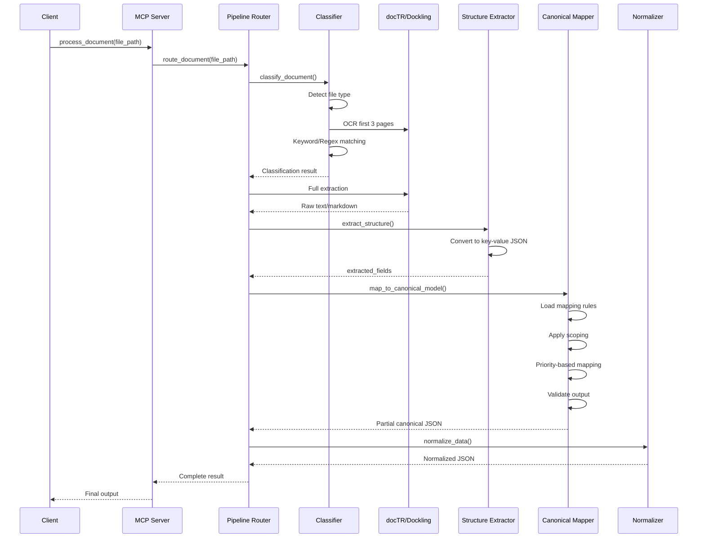
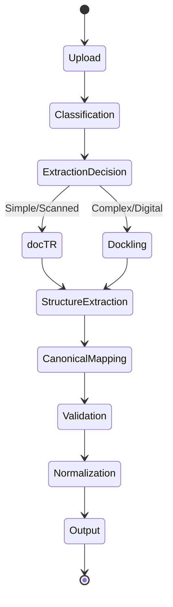

# 📋 Comprehensive Product Requirements Document (PRD)

## Utility MCP Server – Mortgage Document Processing Pipeline

**Version**: 2.0  
**Date**: February 3, 2026  
**Status**: Production Implementation  
**Schema Version**: 2.0.0

---

## Executive Summary

The **Utility MCP Server** is a production-ready **Model Context Protocol (MCP) server** that provides intelligent, deterministic, and scalable processing of U.S. mortgage borrower documents. The system transforms unstructured documents (PDFs, images) into structured, MISMO-compatible canonical data through a multi-stage pipeline combining OCR, structure-aware parsing, LLM-based extraction, and rule-based canonical mapping.

### Key Differentiators

- ✅ **Deterministic Canonical Mapping**: Rule-based (NO LLM) ensures auditability and repeatability
- ✅ **Document Scoping**: Prevents schema pollution through strict section-level access control
- ✅ **Priority-Based Fallback**: Handles field name variations across document formats
- ✅ **MISMO-Ready Architecture**: Schema aligned with MISMO 3.4 standards
- ✅ **Production-Grade**: Structured logging, error handling, and validation

---

## Table of Contents

1. [Product Overview](#1-product-overview)
2. [Target Users & Use Cases](#2-target-users--use-cases)
3. [System Architecture](#3-system-architecture)
4. [Functional Requirements](#4-functional-requirements)
5. [Canonical Model Specification](#5-canonical-model-specification)
6. [Document Processing Pipeline](#6-document-processing-pipeline)
7. [MCP Server Tools](#7-mcp-server-tools)
8. [Technical Specifications](#8-technical-specifications)
9. [Data Flow & Transformations](#9-data-flow--transformations)
10. [Non-Functional Requirements](#10-non-functional-requirements)
11. [Security & Compliance](#11-security--compliance)
12. [Extensibility & Future Roadmap](#12-extensibility--future-roadmap)
13. [Testing & Validation](#13-testing--validation)
14. [Deployment & Operations](#14-deployment--operations)
15. [Success Metrics](#15-success-metrics)

---

## 1. Product Overview

### 1.1 Purpose

The Utility MCP Server serves as a **core document intelligence backend** for mortgage origination, underwriting, and compliance workflows. It enables automated extraction, standardization, and validation of borrower documentation.

### 1.2 Problem Statement

**Current Challenges**:
- Manual data entry from mortgage documents is error-prone and time-consuming
- Document formats vary widely across banks, employers, and government agencies
- No standardized schema for mortgage document data
- Difficult to integrate document data into LOS (Loan Origination Systems)
- Compliance requirements demand audit trails and data provenance

**Solution**:
A unified pipeline that:
1. Automatically classifies mortgage documents
2. Extracts structured data using appropriate tools (OCR or structure-aware parsing)
3. Maps extracted data to a canonical MISMO-compatible schema
4. Normalizes data for downstream consumption
5. Provides audit trails and deterministic processing

### 1.3 Goals

#### Primary Goals
- Accurately classify 19+ mortgage document types with >85% confidence
- Extract structured data from both digital and scanned documents
- Map extracted data to canonical schema with 100% determinism
- Support URLA (Form 1003), bank statements, pay stubs, tax returns, and government IDs
- Provide query capability for ad-hoc document questions

#### Secondary Goals
- Enable MISMO XML generation (future)
- Support multi-document data aggregation
- Provide data quality scoring
- Enable real-time processing via MCP protocol

### 1.4 Non-Goals

- ❌ UI/frontend components (server-only)
- ❌ Automated underwriting decision logic
- ❌ MISMO XML generation (placeholder only in v1.0)
- ❌ LLM hallucination or external data enrichment
- ❌ Document storage/persistence (stateless processing)

---

## 2. Target Users & Use Cases

### 2.1 Target Users

| User Type | Description | Primary Use Cases |
|-----------|-------------|-------------------|
| **Mortgage Technology Platforms** | LOS/POS vendors | Document ingestion, data extraction |
| **Loan Origination Systems** | Enterprise LOS | Borrower data population |
| **Underwriting Automation** | Automated underwriting engines | Document verification, data validation |
| **Compliance Systems** | Audit and compliance platforms | Document tracking, data provenance |
| **Data Engineering Teams** | Internal mortgage tech teams | Pipeline integration, data transformation |

### 2.2 Use Cases

#### Use Case 1: URLA Form Processing
**Actor**: Loan Officer  
**Goal**: Extract borrower information from URLA Form 1003  
**Flow**:
1. Upload URLA PDF to MCP server
2. System classifies as "URLA (Form 1003)"
3. Dockling parser extracts structured markdown
4. LLM converts markdown to key-value JSON (237 fields)
5. Canonical mapper maps to 8 schema sections (deal, loan, parties, employment, financials, collateral, governmentLoans, closing)
6. Return normalized canonical JSON

**Success Criteria**: All borrower, loan, and property data accurately extracted and mapped

#### Use Case 2: Bank Statement Analysis
**Actor**: Underwriter  
**Goal**: Verify borrower assets from bank statements  
**Flow**:
1. Upload bank statement PDF
2. System classifies as "Bank Statement"
3. docTR OCR extracts text
4. LLM structures into account info + transaction list
5. Canonical mapper populates `transaction` and `borrower` sections only
6. Return partial canonical JSON with asset verification data

**Success Criteria**: Account balance, institution name, and transaction history extracted

#### Use Case 3: Pay Stub Income Verification
**Actor**: Automated Underwriting System  
**Goal**: Calculate borrower income from pay stubs  
**Flow**:
1. Upload pay stub PDF
2. System classifies as "Pay Stub"
3. Extract employer, pay period, gross/net income, YTD earnings
4. Map to `employment` and `financials.incomes` sections
5. Return income verification data

**Success Criteria**: Current and YTD income accurately extracted

#### Use Case 4: Document Query
**Actor**: Loan Processor  
**Goal**: Ask questions about uploaded documents  
**Flow**:
1. Upload document (any type)
2. Use `ask_document` tool with natural language question
3. System uses docTR-extracted text (no hallucination)
4. Return factual answer based only on document content

**Success Criteria**: Accurate answers without hallucination

---

## 3. System Architecture

### 3.1 High-Level Architecture



### 3.2 Component Architecture



### 3.3 Data Flow Architecture



---

## 4. Functional Requirements

### 4.1 Document Classification (FR-001)

**Requirement**: System MUST classify all uploaded documents into one of 19+ supported document types.

**Supported Document Types**:

| Category | Document Types |
|----------|----------------|
| **Application Core** | URLA (Form 1003), URLA Unmarried Addendum, URLA Continuation Sheet |
| **Supplemental** | SCIF (Form 1103) |
| **Income & Tax** | Pay Stubs, W-2 Forms, Tax Returns (1040), IRS Form 4506-C, Military LES |
| **Assets & Funds** | Bank Statements, Gift Letter, Investment Statements (401k, IRA, Brokerage) |
| **Property** | Sales Contract, Proof of Insurance, Lease Agreements |
| **Identity** | Government ID (Driver's License, Passport, State ID) |
| **Government Loans** | VA Form 26-1880, VA Form 26-8937 |
| **Closing** | Closing Disclosure (CD) |
| **Fallback** | Unknown/Unsupported Document |

**Classification Method**:
1. File type detection (PDF vs Image)
2. docTR OCR on first 3 pages
3. Keyword matching (weighted scoring)
4. Regex pattern matching (higher weight)
5. Confidence scoring (0.0 - 1.0)

**Output**:
```json
{
  "file_type": "pdf | image",
  "pdf_type": "digital | scanned | n/a",
  "document_category": "URLA | Pay Stub | Bank Statement | ...",
  "recommended_tool": "doctr | dockling",
  "confidence": 0.85,
  "reasoning": "Document is a complex structured form..."
}
```

**Acceptance Criteria**:
- Classification accuracy >85% for supported document types
- Processing time <5 seconds for classification
- Confidence score provided for all classifications

---

### 4.2 Document Extraction (FR-002)

**Requirement**: System MUST extract text/structure from documents using appropriate extraction strategy.

#### 4.2.1 docTR OCR Extraction

**Use Cases**:
- Images (JPG, PNG, HEIC, TIFF)
- Scanned PDFs
- Complex or free-form layouts

**Capabilities**:
- High-recall OCR
- Layout-agnostic
- Multi-page support
- Returns plain text

**Implementation**:
```python
from doctr.io import DocumentFile
from doctr.models import ocr_predictor

model_doctr = ocr_predictor(pretrained=True)
doc = DocumentFile.from_pdf(file_path)
result = model_doctr(doc)
text = result.render()
```

#### 4.2.2 Dockling Structure-Aware Parsing

**Use Cases**:
- Digital PDFs
- Form-heavy documents (URLA, W-2, 1040)
- Table-rich documents

**Capabilities**:
- Table-aware parsing
- Layout preservation
- Structured markdown output
- Ideal for forms

**Implementation**:
```python
from docling.document_converter import DocumentConverter

converter = DocumentConverter()
result = converter.convert(file_path)
markdown = result.document.export_to_markdown()
```

**Decision Logic**:
```python
complex_types = [
    "URLA", "SCIF", "W2", "Tax Return", "Bank Statement",
    "Pay Stub", "Military LES", "Investment Statement",
    "VA Forms", "Closing Disclosure"
]

if document_type in complex_types:
    recommended_tool = "dockling"
else:
    recommended_tool = "doctr"
```

---

### 4.3 Structure Extraction (FR-003)

**Requirement**: System MUST convert raw text/markdown into structured key-value JSON using LLM.

**Purpose**: Bridge the gap between unstructured extraction and structured canonical mapping.

**LLM Prompt Strategy**:
- **Exhaustive extraction**: Capture ALL fields present in document
- **No normalization**: Keep raw values as-is
- **No canonical mapping**: LLM only structures, doesn't map
- **Deterministic instructions**: Minimize hallucination

**Input**: Markdown or plain text + document type  
**Output**: Structured JSON with `extractedFields` object

**Example**:
```json
{
  "documentType": "BankStatement",
  "extractedFields": {
    "institutionName": "Bank of America, N.A.",
    "accountNumberMasked": "****5555",
    "currentBalance": 25000,
    "deposits_1_date": "2024-01-15",
    "deposits_1_amount": 5000,
    "deposits_1_description": "Direct Deposit",
    "firstName": "JOHN",
    "lastName": "DOE",
    "customerAddress_street": "123 Main St",
    "customerAddress_city": "San Francisco",
    "customerAddress_zipCode": "94102"
  }
}
```

**LLM Configuration**:
- Model: GPT-5.1 (configurable)
- Temperature: 0 (deterministic)
- Response format: JSON object
- Max tokens: Auto

**Acceptance Criteria**:
- All visible fields extracted
- No hallucinated data
- Valid JSON output
- Field names are descriptive and consistent

---

### 4.4 Canonical Mapping (FR-004)

**Requirement**: System MUST map extracted fields to canonical MISMO-compatible schema using ONLY rule-based logic (NO LLM).

**Core Principles**:
1. **Deterministic**: Same input → Same output (100% reproducible)
2. **Scoped**: Each document type only populates allowed sections
3. **Partial**: Only populated fields included (no empty initialization)
4. **Priority-based**: Fallback logic for field name variations
5. **Validated**: Output validated against scoping rules

#### 4.4.1 Document Scoping

**Scoping Rules**:
```python
DOCUMENT_SCOPE = {
    "BankStatement": {"transaction", "borrower"},
    "PayStub": {"financials.incomes", "employment"},
    "W2": {"financials.incomes"},
    "URLA": {
        "deal", "loan", "parties", "employment",
        "financials", "collateral", "governmentLoans", "closing"
    },
    "GovernmentID": {"parties"},
    "SalesContract": {"collateral"},
    "PropertyAppraisal": {"collateral"},
    "TaxReturn": {"financials.incomes"},
    "CreditReport": {"financials.liabilities"}
}
```

**Enforcement**:
- Mapping rules checked against allowed sections
- Disallowed paths skipped with warning
- Output validated post-mapping
- `ValueError` raised if scope violated

#### 4.4.2 Mapping Rules Format

**Standard Field Mapping**:
```json
{
  "sourceField": "institutionName",
  "targetPath": "transaction.assets[0].institutionName",
  "priority": 1
}
```

**Priority-Based Mapping**:
```json
[
  {
    "sourceField": "institutionName",
    "targetPath": "transaction.assets[0].institutionName",
    "priority": 1
  },
  {
    "sourceField": "bankName",
    "targetPath": "transaction.assets[0].institutionName",
    "priority": 2
  }
]
```

**List Pattern Mapping**:
```json
{
  "type": "listPattern",
  "targetPath": "transaction.list",
  "sourcePrefix": "deposits",
  "priority": 1,
  "itemMapping": {
    "amount": "amount",
    "date": "date",
    "description": "description"
  }
}
```

#### 4.4.3 Mapping Algorithm

```python
def map(document_type, extracted_fields):
    # 1. Load mapping rules
    rules = load_mapping_rules(document_type)
    
    # 2. Get allowed sections
    allowed_sections = DOCUMENT_SCOPE[document_type]
    
    # 3. Group rules by target path
    rules_by_target = group_by_target(rules)
    
    # 4. Apply mapping with priority selection
    result = {}
    for target_path, rules in rules_by_target.items():
        # Check scoping
        if not is_path_allowed(target_path, allowed_sections):
            continue
        
        # Handle list patterns
        if has_list_pattern(rules):
            process_list_pattern(extracted_fields, target_path, rules, result)
            continue
        
        # Standard field mapping with priority
        sorted_rules = sort_by_priority(rules)
        for rule in sorted_rules:
            value = extracted_fields.get(rule.sourceField)
            if value is not None:
                set_nested_value(result, target_path, value)
                break  # First match wins
    
    # 5. Validate output
    validate_output(result, allowed_sections, document_type)
    
    return result
```

**Acceptance Criteria**:
- 100% deterministic (no randomness)
- Scoping enforced (no disallowed sections)
- Priority respected (first match wins)
- List patterns supported
- Validation passed

---

### 4.5 Normalization (FR-005)

**Requirement**: System MUST normalize canonical data according to data dictionary standards.

**Current Status**: Placeholder (pass-through)

**Future Normalization Rules**:

| Data Type | Input Examples | Output Format |
|-----------|----------------|---------------|
| **Dates** | `01/15/2024`, `Jan 15, 2024`, `2024-01-15` | `2024-01-15` (ISO-8601) |
| **Currency** | `$25,000.00`, `25000`, `25K` | `25000` (numeric) |
| **Phone** | `(555) 123-4567`, `555-123-4567` | `+15551234567` (E.164) |
| **SSN** | `123-45-6789` | `***-**-6789` (masked) |
| **Enumerations** | `full time`, `Full-Time`, `FT` | `FullTime` (controlled vocab) |
| **State Codes** | `California`, `calif`, `CA` | `CA` (2-letter code) |

**Implementation**:
```python
def normalize_data(canonical_json):
    # Date normalization
    canonical_json = normalize_dates(canonical_json)
    
    # Currency normalization
    canonical_json = normalize_currency(canonical_json)
    
    # Enumeration normalization
    canonical_json = normalize_enums(canonical_json)
    
    # Phone normalization
    canonical_json = normalize_phones(canonical_json)
    
    # SSN masking
    canonical_json = mask_sensitive_data(canonical_json)
    
    return canonical_json
```

---

### 4.6 Document Query (FR-006)

**Requirement**: System MUST support natural language queries about uploaded documents.

**Rules**:
- Uses ONLY docTR-extracted text (no external knowledge)
- No hallucinations
- Fully deterministic
- Factual answers only

**Implementation**:
```python
def query_document(file_path, question):
    # Extract text using docTR
    text = extract_with_doctr(file_path)
    
    # Use LLM to answer based ONLY on extracted text
    answer = llm_query(text, question, strict_mode=True)
    
    return answer
```

**Example**:
```python
query_document("bank_statement.pdf", "What is the ending balance?")
# Returns: "$25,000.00"

query_document("pay_stub.pdf", "Who is the employer?")
# Returns: "ABC Corporation"
```

---

## 5. Canonical Model Specification

### 5.1 Schema Version

**Version**: 2.0.0  
**Location**: `resources/canonical_schema/schema.json`  
**MISMO Alignment**: Compatible with MISMO 3.4

### 5.2 Schema Sections

#### Section 1: transaction
**Purpose**: Bank account information and transaction history  
**Used By**: Bank Statement

```json
{
  "transaction": {
    "assets": [
      {
        "institutionName": "",
        "accountNumberMasked": "",
        "currentBalance": 0,
        "accountType": ""
      }
    ],
    "list": [
      {
        "date": "",
        "description": "",
        "amount": 0
      }
    ]
  }
}
```

#### Section 2: borrower
**Purpose**: Simplified borrower information  
**Used By**: Bank Statement, Government ID

```json
{
  "borrower": [
    {
      "firstName": "",
      "lastName": "",
      "address": {
        "street": "",
        "city": "",
        "state": "",
        "zipCode": "",
        "country": ""
      }
    }
  ]
}
```

#### Section 3: deal
**Purpose**: Deal/application metadata  
**Used By**: URLA

```json
{
  "deal": {
    "dealId": "",
    "applicationDate": "",
    "loanPurpose": "",
    "dealStatus": "InProgress",
    "documentsProvided": [
      {
        "documentType": "",
        "documentId": "",
        "receivedDate": "",
        "confidence": 0.0
      }
    ]
  }
}
```

#### Section 4: loan
**Purpose**: Loan-specific details  
**Used By**: URLA

```json
{
  "loan": {
    "loanAmount": 0,
    "loanTermMonths": 0,
    "interestRate": 0.0,
    "loanPurpose": "Purchase",
    "mortgageType": "Conventional",
    "loanProgram": "",
    "amortizationType": "Fixed",
    "downPaymentAmount": 0,
    "firstPaymentDate": ""
  }
}
```

#### Section 5: parties
**Purpose**: Detailed party information (borrowers, co-borrowers)  
**Used By**: URLA, Government ID

```json
{
  "parties": [
    {
      "partyId": "",
      "role": "Borrower",
      "taxpayerIdentifier": {
        "type": "SSN",
        "value": ""
      },
      "individual": {
        "firstName": "",
        "lastName": "",
        "dateOfBirth": "",
        "maritalStatus": "",
        "citizenshipStatus": ""
      },
      "contact": {
        "phone": "",
        "email": ""
      },
      "currentAddress": {
        "street": "",
        "city": "",
        "state": "",
        "zipCode": "",
        "country": "US"
      }
    }
  ]
}
```

#### Section 6: employment
**Purpose**: Employment history  
**Used By**: URLA, Pay Stub

```json
{
  "employment": [
    {
      "partyId": "",
      "employerName": "",
      "employmentType": "FullTime",
      "startDate": "",
      "endDate": "",
      "selfEmployed": false
    }
  ]
}
```

#### Section 7: financials
**Purpose**: Income, assets, liabilities  
**Used By**: URLA, Pay Stub, Bank Statement, Tax Returns

```json
{
  "financials": {
    "incomes": [
      {
        "partyId": "",
        "incomeType": "Base",
        "amount": 0,
        "frequency": "Monthly",
        "sourceDocument": "PayStub"
      }
    ],
    "assets": [
      {
        "partyId": "",
        "assetType": "Checking",
        "institutionName": "",
        "accountNumberMasked": "",
        "currentBalance": 0,
        "averageBalance": 0,
        "sourceDocument": "BankStatement"
      }
    ],
    "liabilities": [
      {
        "partyId": "",
        "liabilityType": "CreditCard",
        "creditorName": "",
        "monthlyPayment": 0,
        "remainingBalance": 0
      }
    ]
  }
}
```

#### Section 8: collateral
**Purpose**: Property/collateral information  
**Used By**: URLA, Sales Contract, Property Appraisal

```json
{
  "collateral": {
    "propertyAddress": {
      "street": "",
      "city": "",
      "state": "",
      "zipCode": ""
    },
    "propertyValue": 0
  }
}
```

#### Section 9: governmentLoans
**Purpose**: Government-backed loan details  
**Used By**: URLA, VA Forms

```json
{
  "governmentLoans": {
    "va": {
      "coeNumber": "",
      "eligible": false
    }
  }
}
```

#### Section 10: closing
**Purpose**: Closing information  
**Used By**: URLA, Closing Disclosure

```json
{
  "closing": {
    "closingDate": "",
    "monthlyPayment": 0,
    "cashToClose": 0
  }
}
```

---

## 6. Document Processing Pipeline

### 6.1 Pipeline Stages



### 6.2 Stage Details

#### Stage 1: Upload & File Detection
- Accept PDF or image files
- Validate file format
- Detect file type (PDF vs Image)
- Check file size limits

#### Stage 2: Classification
- Extract first 3 pages with docTR
- Keyword matching (1 point per match)
- Regex matching (3 points per match)
- Calculate confidence score
- Recommend extraction tool

#### Stage 3: Extraction
- Route to docTR or Dockling based on recommendation
- Extract full document content
- Return raw text or structured markdown

#### Stage 4: Structure Extraction
- Send to LLM with extraction prompt
- Convert to key-value JSON
- Validate JSON structure
- Save extracted fields

#### Stage 5: Canonical Mapping
- Load document-specific mapping rules
- Apply scoping rules
- Execute priority-based mapping
- Handle list patterns
- Validate output against scoping

#### Stage 6: Normalization
- Apply data dictionary rules
- Normalize dates, currency, enums
- Mask sensitive data
- Validate data types

#### Stage 7: Output
- Return partial canonical JSON
- Save to output directory (optional)
- Log processing metrics

---

## 7. MCP Server Tools

### 7.1 Tool Registry

The MCP server exposes the following tools via FastMCP:

#### Tool 1: process_document
**Purpose**: Complete end-to-end document processing

```python
@mcp.tool()
def process_document(file_path: str) -> dict:
    """
    Process a mortgage document through the unified pipeline.
    Classifies, extracts, maps, and normalizes the data.
    """
```

**Input**: File path (PDF or image)  
**Output**: Complete processing result with all pipeline stages

#### Tool 2: classify_file
**Purpose**: Document classification only

```python
@mcp.tool()
def classify_file(file_path: str) -> dict:
    """
    Classify a document without full extraction.
    """
```

**Input**: File path  
**Output**: Classification result with confidence score

#### Tool 3: ask_document
**Purpose**: Natural language document query

```python
@mcp.tool()
def ask_document(file_path: str, question: str) -> str:
    """
    Ask a question about a document.
    """
```

**Input**: File path + question  
**Output**: Factual answer based on document content

#### Tool 4: parse_document_with_dockling
**Purpose**: Structure-aware PDF parsing

```python
@mcp.tool()
def parse_document_with_dockling(file_path: str) -> str:
    """
    Structure-aware parsing for digital, form-heavy PDFs using Dockling.
    Returns structured Markdown. Ideal for URLA-like forms.
    """
```

**Input**: File path (PDF)  
**Output**: Structured markdown

#### Tool 5: map_to_canonical_schema
**Purpose**: Rule-based canonical mapping

```python
@mcp.tool()
def map_to_canonical_schema(document_type: str, extracted_fields: dict) -> dict:
    """
    Map extracted document fields to canonical schema using rule-based logic.
    """
```

**Input**: Document type + extracted fields  
**Output**: Partial canonical JSON

#### Tool 6: extract_structure_from_markdown
**Purpose**: LLM-based structure extraction

```python
@mcp.tool()
def extract_structure_from_markdown(markdown_file_path: str, document_type: str) -> dict:
    """
    Extract structured key-value pairs from a Markdown file using LLM.
    """
```

**Input**: Markdown file path + document type  
**Output**: Structured JSON with extracted fields

---

## 8. Technical Specifications

### 8.1 Technology Stack

| Component | Technology | Version | Purpose |
|-----------|-----------|---------|---------|
| **MCP Framework** | FastMCP | Latest | MCP server implementation |
| **OCR Engine** | docTR | Latest | OCR-based text extraction |
| **Structure Parser** | Dockling | Latest | Structure-aware PDF parsing |
| **LLM** | OpenAI GPT-5.1 | Configurable | Structure extraction |
| **Validation** | Pydantic | Latest | Data validation |
| **Server** | Uvicorn | Latest | ASGI server |
| **Language** | Python | 3.10+ | Core implementation |

### 8.2 Dependencies

```txt
fastmcp
python-doctr
dockling
pydantic
uvicorn
openai
python-dotenv
```

### 8.3 File Structure

```
utility-mcp/
├── server.py                          # FastMCP server entry point
├── requirements.txt                   # Python dependencies
├── .env                               # Environment variables
│
├── orchestrator/
│   └── pipeline_router.py             # Pipeline orchestration
│
├── tools/
│   ├── classifier.py                  # Document classifier (215 lines)
│   ├── doctr_tool.py                  # docTR OCR wrapper
│   ├── dockling_tool.py               # Dockling parser wrapper
│   ├── structure_extractor.py         # LLM structure extraction (109 lines)
│   ├── canonical_mapper.py            # Canonical mapping engine (516 lines)
│   ├── normalization.py               # Data normalization
│   ├── query.py                       # Document query tool
│   ├── prompts.py                     # LLM prompts (149 lines)
│   └── unified_extraction.py          # Unified extraction orchestrator
│
├── resources/
│   ├── canonical_schema/
│   │   └── schema.json                # Canonical schema definition
│   └── canonical_mappings/
│       ├── BankStatement.json         # 14 mapping rules
│       ├── PayStub.json               # 7 mapping rules
│       ├── URLA.json                  # 237 mapping rules
│       ├── GovernmentID.json          # 8 mapping rules
│       └── README.md                  # Mapping documentation
│
├── utils/
│   ├── logging.py                     # Structured logging
│   ├── file_utils.py                  # File utilities
│   └── pdf_utils.py                   # PDF utilities
│
├── output/                            # Processing output directory
├── logs/                              # Application logs
│
├── test_pipeline.py                   # Complete pipeline test
├── test_urla.py                       # URLA-specific test
├── test_paystub.py                    # Pay stub test
│
└── DOCUMENTATION/
    ├── CANONICAL_MODEL_DOCUMENTATION.md
    ├── MAPPING_EXAMPLES.md
    ├── CANONICAL_QUICK_REFERENCE.md
    └── README_DOCUMENTATION.md
```

### 8.4 Configuration

**Environment Variables**:
```bash
# OpenAI Configuration
OPENAI_API_KEY=sk-...
OPENAI_BASE_URL=https://api.openai.com/v1

# Server Configuration
MCP_SERVER_PORT=8000
LOG_LEVEL=INFO

# Processing Configuration
MAX_PAGES_CLASSIFICATION=3
CLASSIFICATION_CONFIDENCE_THRESHOLD=0.5
```

---

## 9. Data Flow & Transformations

### 9.1 Example: Bank Statement Processing

#### Input Document
```
Bank of America
Account Summary
Account Number: ****5555
Ending Balance: $25,000.00

Transactions:
01/15/2024  Direct Deposit    $5,000.00
01/22/2024  Transfer          $3,000.00
```

#### Stage 1: Classification Output
```json
{
  "file_type": "pdf",
  "pdf_type": "scanned",
  "document_category": "Bank Statement",
  "recommended_tool": "ocr_document",
  "confidence": 0.85,
  "reasoning": "Document contains bank statement keywords..."
}
```

#### Stage 2: Raw Extraction (docTR)
```
Bank of America
Account Summary
Account Number: ****5555
Ending Balance: $25,000.00
...
```

#### Stage 3: Structure Extraction (LLM)
```json
{
  "documentType": "BankStatement",
  "extractedFields": {
    "institutionName": "Bank of America, N.A.",
    "accountNumberMasked": "****5555",
    "currentBalance": 25000,
    "deposits_1_date": "01/15/2024",
    "deposits_1_amount": 5000,
    "deposits_1_description": "Direct Deposit",
    "deposits_2_date": "01/22/2024",
    "deposits_2_amount": 3000,
    "deposits_2_description": "Transfer"
  }
}
```

#### Stage 4: Canonical Mapping
```json
{
  "transaction": {
    "assets": [
      {
        "institutionName": "Bank of America, N.A.",
        "accountNumberMasked": "****5555",
        "currentBalance": 25000
      }
    ],
    "list": [
      {
        "date": "01/15/2024",
        "amount": 5000,
        "description": "Direct Deposit"
      },
      {
        "date": "01/22/2024",
        "amount": 3000,
        "description": "Transfer"
      }
    ]
  }
}
```

#### Stage 5: Normalization (Future)
```json
{
  "transaction": {
    "assets": [
      {
        "institutionName": "Bank of America, N.A.",
        "accountNumberMasked": "****5555",
        "currentBalance": 25000
      }
    ],
    "list": [
      {
        "date": "2024-01-15",
        "amount": 5000,
        "description": "Direct Deposit"
      },
      {
        "date": "2024-01-22",
        "amount": 3000,
        "description": "Transfer"
      }
    ]
  }
}
```

---

## 10. Non-Functional Requirements

### 10.1 Performance

| Metric | Requirement | Target |
|--------|-------------|--------|
| **Classification Time** | <5 seconds | <3 seconds |
| **Extraction Time (docTR)** | <10 seconds/page | <7 seconds/page |
| **Extraction Time (Dockling)** | <15 seconds/page | <10 seconds/page |
| **Structure Extraction (LLM)** | <30 seconds | <20 seconds |
| **Canonical Mapping** | <1 second | <500ms |
| **End-to-End Processing** | <60 seconds | <40 seconds |
| **Concurrent Requests** | 10 simultaneous | 20 simultaneous |

### 10.2 Reliability

- **Uptime**: 99.9% availability
- **Error Handling**: Graceful degradation
- **Retry Logic**: 3 retries with exponential backoff
- **Timeout Handling**: Configurable timeouts per stage
- **Data Validation**: Schema validation at each stage

### 10.3 Scalability

- **Horizontal Scaling**: Stateless design enables multiple instances
- **Page-wise Processing**: Avoid loading full PDFs into memory
- **Parallelizable**: Tool execution can be parallelized
- **Resource Limits**: Configurable memory and CPU limits

### 10.4 Observability

- **Structured Logging**: JSON-formatted logs
- **Correlation IDs**: Track requests across pipeline stages
- **Metrics**: Processing time, success rate, error rate per tool
- **Audit Trail**: Complete processing history per document

### 10.5 Security

- **No Persistence**: Documents not stored unless configured
- **Data Masking**: Sensitive data (SSN) masked in output
- **Access Control**: Controlled access to resources
- **API Key Management**: Secure OpenAI API key storage
- **Input Validation**: File type and size validation

---

## 11. Security & Compliance

### 11.1 Data Privacy

- **PII Handling**: Automatic masking of SSN, account numbers
- **Data Retention**: No document storage by default
- **Encryption**: TLS for API communication
- **Audit Logs**: Complete processing audit trail

### 11.2 Compliance

- **MISMO Alignment**: Schema compatible with MISMO 3.4
- **Audit-Friendly**: Deterministic processing enables audits
- **Data Provenance**: Track data source for each field
- **Regulatory Compliance**: Designed for mortgage industry regulations

---

## 12. Extensibility & Future Roadmap

### 12.1 Phase 1 (Current - v1.0)

✅ Document classification (19+ types)  
✅ docTR and Dockling extraction  
✅ LLM structure extraction  
✅ Canonical mapping (rule-based)  
✅ Document query capability  
✅ MCP server implementation  

### 12.2 Phase 2 (Q2 2026)

🔲 MISMO XML generation  
🔲 XSD validation  
🔲 Advanced normalization (dates, currency, enums)  
🔲 Data quality scoring  
🔲 Multi-document aggregation  

### 12.3 Phase 3 (Q3 2026)

🔲 Business rule validation  
🔲 Completeness scoring  
🔲 Anomaly detection  
🔲 Real-time processing optimization  
🔲 Batch processing support  

### 12.4 Phase 4 (Q4 2026)

🔲 Machine learning classification  
🔲 Custom document type support  
🔲 Workflow orchestration  
🔲 Integration with major LOS platforms  

---

## 13. Testing & Validation

### 13.1 Test Strategy

#### Unit Tests
- Classifier keyword/regex matching
- Canonical mapper scoping enforcement
- Priority-based field selection
- List pattern mapping

#### Integration Tests
- End-to-end pipeline processing
- docTR extraction accuracy
- Dockling parsing accuracy
- LLM structure extraction quality

#### Validation Tests
- Schema validation
- Scoping validation
- Data type validation
- MISMO compatibility

### 13.2 Test Files

```bash
# Complete pipeline test
python test_pipeline.py

# Document-specific tests
python test_urla.py
python test_paystub.py

# Manual pipeline test
python manual_pipeline_test.py
```

### 13.3 Test Coverage

- **Classifier**: 19+ document types
- **Mapping Rules**: 266+ total rules (237 URLA + 14 BankStatement + 7 PayStub + 8 GovernmentID)
- **Schema Sections**: All 10 sections
- **Document Scoping**: 9 document types

---

## 14. Deployment & Operations

### 14.1 Deployment

```bash
# Install dependencies
pip install -r requirements.txt

# Configure environment
cp env.example .env
# Edit .env with API keys

# Run server
python server.py

# Or use batch file (Windows)
run_server.bat
```

### 14.2 Monitoring

- **Logs**: `logs/` directory
- **Output**: `output/` directory
- **Metrics**: Processing time per stage
- **Errors**: Structured error logging

### 14.3 Maintenance

- **Mapping Rules**: Update JSON files in `resources/canonical_mappings/`
- **Schema Updates**: Modify `resources/canonical_schema/schema.json`
- **Document Types**: Add to classifier keywords/regex
- **Scoping Rules**: Update `DOCUMENT_SCOPE` in `canonical_mapper.py`

---

## 15. Success Metrics

### 15.1 Accuracy Metrics

| Metric | Target | Measurement |
|--------|--------|-------------|
| **Classification Accuracy** | >85% | % correctly classified documents |
| **Extraction Completeness** | >90% | % of visible fields extracted |
| **Mapping Accuracy** | 100% | % correctly mapped fields (rule-based) |
| **Data Quality Score** | >95% | % of fields passing validation |

### 15.2 Performance Metrics

| Metric | Target | Measurement |
|--------|--------|-------------|
| **Processing Time** | <60s | Average end-to-end time |
| **Throughput** | 100 docs/hour | Documents processed per hour |
| **Error Rate** | <1% | % of failed processing attempts |
| **Uptime** | 99.9% | Server availability |

### 15.3 Business Metrics

| Metric | Target | Impact |
|--------|--------|--------|
| **Manual Data Entry Reduction** | 80% | Time saved vs manual entry |
| **Processing Cost Reduction** | 60% | Cost vs manual processing |
| **Loan Processing Time** | -50% | Reduction in overall loan processing time |
| **Data Accuracy Improvement** | +40% | Improvement vs manual entry |

---

## Appendices

### Appendix A: Glossary

- **MISMO**: Mortgage Industry Standards Maintenance Organization
- **URLA**: Uniform Residential Loan Application (Form 1003)
- **LOS**: Loan Origination System
- **MCP**: Model Context Protocol
- **OCR**: Optical Character Recognition
- **Canonical Schema**: Standardized data model
- **Document Scoping**: Access control for schema sections

### Appendix B: References

- MISMO 3.4 Reference Model
- FastMCP Documentation
- docTR Documentation
- Dockling Documentation
- OpenAI API Documentation

### Appendix C: Change Log

| Version | Date | Changes |
|---------|------|---------|
| 2.0 | 2026-02-03 | Comprehensive PRD with implementation details |
| 1.0 | 2026-01-15 | Initial PRD |

---

**Document Status**: Final  
**Approval**: Pending  
**Next Review**: 2026-03-01

---

**END OF COMPREHENSIVE PRD**
