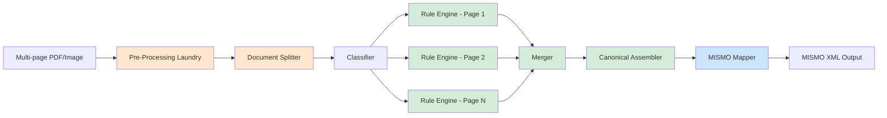

# Data Extraction Pipeline Architecture

## Overview

The Confer LOS Data Extraction Pipeline is a **Zero-LLM, rule-based system** designed to transform mortgage loan documents (PDFs, images) into MISMO 3.4 XML — the industry standard for loan data exchange. The architecture emphasizes **deterministic processing**, **parallel execution**, and **business-user maintainability** through YAML-based rules.

This document describes the **INTENDED architecture** (the target design). Some components are still in development.

---

## System Diagram



**Legend:**
- 🟠 Orange: Pre-processing (Standardization)
- 🟢 Green: Zero-LLM Rule-Based Processing
- 🔵 Blue: MISMO Output (Compliance)

---

## Architecture Principles

### 1. Zero-LLM Design
**No AI variability.** All extraction logic is rule-based (YAML patterns, regex, keyword matching). This ensures:
- **Deterministic outputs** (same input = same output)
- **Audit compliance** (traceable rules)
- **Cost efficiency** (no API calls)
- **Offline capability** (no internet required)

### 2. Parallel Processing ("The Factory")
Documents are split into **pages**, and each page is processed independently through the Rule Engine. This enables:
- **Cloud-native scaling** (AWS Lambda, Temporal workflows)
- **Fault isolation** (one page failure doesn't block others)
- **Performance** (multi-core utilization)

### 3. Canonical Schema First
All data flows through a **single canonical schema** (`schema.json`) before MISMO conversion. This:
- **Decouples extraction from output format** (easy to add new formats like URLA JSON, Encompass XML)
- **Centralizes validation** (enum checking, required fields)
- **Simplifies merging** (common structure for all doc types)

### 4. Rule-Driven Maintenance
YAML rule files are **owned by business analysts**, not engineers. Example:
```yaml
# rules/w2.yaml
document_type: "W-2 Form"
rules:
  - field: "wages"
    canonical_path: "deal.parties[0].employment[0].income.base_amount"
    pattern: "Wages, tips, other compensation"
    extraction_type: "currency_after_label"
    priority: 10  # High (IRS verified)
```

---

## Component Descriptions

### 1. Pre-Processing Laundry
**Status:** ⚠️ TO BE BUILT
**File:** `laundry/image_converter.py`

**Purpose:** Convert image files (JPEG, PNG, TIFF) to PDF format for standardized processing.

**Technology Stack:**
- **RapidOCR** (ONNX runtime) - Fast OCR engine
- **pypdf** - PDF manipulation

**Why Needed:**
- Standardizes pipeline input (always PDF)
- Enables text search in image-only documents
- Reduces downstream complexity (single format)

---

### 2. Document Splitter
**Status:** ⚠️ TO BE BUILT
**File:** `splitter/doc_splitter.py`

**Purpose:** Split multi-page PDFs into individual single-page PDFs for parallel processing.

**Technology Stack:**
- **pypdf** - Page extraction

**Output Example:**
```python
[
    "/tmp/loan_123_page_1.pdf",  # URLA Page 1
    "/tmp/loan_123_page_2.pdf",  # URLA Page 2
    "/tmp/loan_123_page_3.pdf",  # W-2 Form
    "/tmp/loan_123_page_4.pdf",  # Bank Statement
]
```

---

### 3. Classifier
**Status:** ✅ BUILT
**File:** `tools/classifier.py`

**Purpose:** Identify document type and select extraction strategy.

**Supported Types (14 total):**
- **Application Core:** URLA (1003), URLA Addendums, SCIF (1103)
- **Income/Tax:** W-2, Pay Stub, 1040, 4506-C, Military LES
- **Assets:** Bank Statement, Investment Statement, Gift Letter
- **Property:** Sales Contract, Lease Agreement, Insurance
- **Identity:** Government ID
- **Closing:** Closing Disclosure
- **VA Loans:** VA Form 26-1880, 26-8937

**Scoring System:**
- **Keyword match:** +1 point per keyword
- **Regex match:** +3 points per pattern
- **Confidence:** `min(0.5 + (score * 0.1), 0.95)`

---

### 4. Rule Engine
**Status:** ⚠️ TO BE BUILT
**File:** `engine/rule_engine.py`

**Purpose:** Extract structured data from documents using YAML-defined rules (Zero-LLM).

**Technology Stack:**
- **Doctr** - OCR text extraction
- **Regex** - Pattern matching
- **YAML** - Rule definitions

**Rule File Structure:**
```yaml
document_type: "W-2 Form"
priority: 10  # Higher = more trusted (W-2 > URLA)

rules:
  - field: "wages"
    canonical_path: "deal.parties[0].employment[0].income.base_amount"
    pattern: "Wages, tips, other compensation\\s*\\$?([\\d,]+\\.\\d{2})"
    extraction_type: "regex"
    data_type: "currency"
    required: true
```

**Output Example:**
```python
{
    "wages": 75000.00,
    "employer_name": "Acme Corporation",
    "borrower_ssn": "123-45-6789",  # Identity key for merging
    "_metadata": {
        "document_type": "W-2 Form",
        "priority": 10,
        "page_number": 1
    }
}
```

---

### 5. Merger
**Status:** ⚠️ TO BE BUILT
**File:** `merger/canonical_merger.py`

**Purpose:** Merge flat dictionaries from multiple documents into a single unified dictionary.

**Key Logic:**

#### A. Priority Resolution
```python
DOCUMENT_PRIORITY = {
    "W-2 Form": 10,           # IRS verified (highest trust)
    "Tax Return (1040)": 9,
    "Pay Stub": 7,
    "Bank Statement": 6,
    "URLA (Form 1003)": 3,    # Self-reported (lowest trust)
}
```

#### B. Identity Resolution
Match borrowers across documents using **identity keys** (SSN primary, Name+DOB fallback).

---

### 6. Canonical Assembler
**Status:** ⚠️ TO BE BUILT
**File:** `assembler/canonical_assembler.py`

**Purpose:** Transform flat merged dictionary into nested canonical JSON structure.

**Transformation:**
```python
# Input (Flat):
{"borrower_first_name": "John", "wages": 75000}

# Output (Nested Canonical):
{
    "deal": {
        "parties": [{
            "individual": {"first_name": "John"},
            "employment": [{"income": {"base_amount": 75000.00}}]
        }]
    }
}
```

---

### 7. MISMO Mapper
**Status:** ✅ BUILT
**File:** `tools/mismo_mapper.py`

**Purpose:** Convert canonical JSON to MISMO 3.4 XML (industry standard format).

**Mapping Rules:** 98 deterministic XPath mappings in `resources/mismo_mapping/map_mismo_3_6.json`

**Example Rule:**
```json
{
    "canonicalPath": "deal.parties[].individual.first_name",
    "mismoXPath": "/MESSAGE/DEAL_SETS/DEAL_SET/DEALS/DEAL/PARTIES/PARTY/INDIVIDUAL/NAME/FirstName"
}
```

---

### 8. Schema Registry
**Status:** ✅ BUILT
**File:** `schema_registry.py`

**Purpose:** Centralized schema management (Singleton pattern).

**Enum Structure:**
```json
{
    "loan_purpose": {
        "value": null,
        "options": ["Purchase", "Refinance", "Construction", "Other"]
    }
}
```

---

### 9. FastMCP Server
**Status:** ✅ BUILT
**File:** `server.py`

**Purpose:** Model Context Protocol (MCP) API gateway for tool integration.

**Exposed Tools:**
```python
@mcp.tool()
def process_document(file_path: str) -> dict:
    """Full pipeline: Classify → Extract → MISMO"""

@mcp.tool()
def list_loans(limit: int = 100) -> dict:
    """Retrieve all processed loans (Phase 2: Supabase)"""
```

---

## Technology Stack

| Layer | Technology | Purpose |
|-------|------------|---------|
| **OCR** | Doctr (ONNX) | Text extraction from PDFs/images |
| **PDF** | pypdf | Page splitting, manipulation |
| **Rules** | YAML + Regex | Field extraction patterns |
| **Schema** | JSON + Pydantic | Validation, type checking |
| **Database** | Supabase (Postgres) | Loan state persistence |
| **API** | FastMCP | Tool integration (Claude, IDEs) |
| **Orchestration** | Temporal (future) | Workflow management, retries |

---

## File Locations

```
Data-Extraction/
├── laundry/
│   └── image_converter.py        # ⚠️ TO BE BUILT
├── splitter/
│   └── doc_splitter.py            # ⚠️ TO BE BUILT
├── tools/
│   ├── classifier.py              # ✅ BUILT
│   ├── mismo_mapper.py            # ✅ BUILT
│   ├── doctr_tool.py              # ✅ BUILT
│   └── unified_extraction.py     # ✅ BUILT
├── engine/
│   └── rule_engine.py             # ⚠️ TO BE BUILT
├── merger/
│   └── canonical_merger.py        # ⚠️ TO BE BUILT
├── assembler/
│   └── canonical_assembler.py     # ⚠️ TO BE BUILT
├── resources/
│   ├── canonical_schema/
│   │   └── schema.json            # ✅ 315 lines
│   ├── mismo_mapping/
│   │   └── map_mismo_3_6.json     # ✅ 98 mappings
│   └── rules/                     # ⚠️ TO BE BUILT
│       ├── w2.yaml
│       ├── urla.yaml
│       └── paystub.yaml
├── schema_registry.py             # ✅ BUILT
├── enum_validator.py              # ✅ BUILT
├── server.py                      # ✅ BUILT
└── src/db/
    └── supabase_client.py         # ⚠️ Phase 2
```

---

## Future Enhancements

### Phase 3: Complete Zero-LLM Transition
- Build YAML rule engine
- Create rule files for 14 document types
- Implement merger with priority logic
- Build canonical assembler
- Remove LLM dependencies

### Phase 4: Production Readiness
- Temporal workflow integration
- Multi-tenancy (customer isolation)
- Compliance audit logs (SOC 2, GLBA)
- Performance benchmarks (target: <5s per loan)
