# Confer LOS Pipeline Architecture

## System Overview

The Confer LOS (Loan Origination System) Data Extraction Pipeline transforms mortgage loan documents into MISMO 3.4 XML through a **deterministic, rule-based processing chain**. The architecture prioritizes **auditability**, **offline processing**, and **stateful merging** of multi-document loan packages.

---

## Current Architecture (Post-Phase 1)

### Pipeline Diagram

```mermaid
graph LR
    A[Multi-Document Upload] --> B[Ingest]
    B --> C[Converter]
    C --> D[Splitter]
    D --> E[Extractor]
    E --> F[Merger]
    F --> G[Canonical Assembler]
    G --> H[MISMO XML Generator]
    H --> I[Supabase Storage]

    C -->|Image→PDF| C1[RapidOCR]
    D -->|Multi-page→Pages| D1[pypdf]
    E -->|YAML Rules| E1[Rule Engine]
    F -->|Priority Logic| F1[Identity Resolution]
    I -->|Stateful| I1[Loan State DB]

    style C fill:#ffe6cc
    style D fill:#ffe6cc
    style E fill:#d4edda
    style F fill:#d4edda
    style G fill:#d4edda
    style H fill:#cce5ff
    style I fill:#e7f3ff
```



**Legend:**
- 🟠 **Pre-Processing** (Converter, Splitter)
- 🟢 **Rule-Based Extraction** (Zero-LLM)
- 🔵 **Output Generation** (MISMO XML)
- 🔷 **Persistence** (Supabase)

---

## Component Descriptions

### 1. Ingest
**Status:** ✅ COMPLETE
**File:** `main.py`

**Purpose:** Entry point for file uploads. Accepts "Mega-PDFs" (multi-document packages) or individual files.

**Logic:**
```python
# main.py
if file_path.endswith('.pdf'):
    # Route to preprocessing
    result = process_mega_pdf(file_path)
```

**Output:** File path to raw input (PDF or image).

---

### 2. Converter (Image → PDF)
**Status:** ✅ COMPLETE
**File:** `src/preprocessing/converter.py`

**Purpose:** Standardize all inputs to PDF format with embedded text layer.

**Technology Stack:**
- **RapidOCR** (ONNX runtime) - Fast OCR engine
- **pypdf** - PDF creation

**Logic:**
```python
def convert_image_to_pdf(image_path: str) -> str:
    """
    Convert JPEG/PNG/TIFF to searchable PDF.

    Process:
    1. Run OCR to extract text
    2. Create PDF with text layer
    3. Save to temp/converted/

    Returns:
        str: Path to converted PDF
    """
```

**Input:** `image_path` (JPEG, PNG, TIFF)
**Output:** `temp/converted/{filename}.pdf`

---

### 3. Splitter (Multi-page → Pages)
**Status:** ✅ COMPLETE
**File:** `src/preprocessing/splitter.py`

**Purpose:** Split multi-page PDFs into single-page chunks for parallel processing.

**Technology Stack:**
- **pypdf** - Page extraction

**Logic:**
```python
def split_pdf(pdf_path: str) -> List[str]:
    """
    Split multi-page PDF into individual pages.

    Process:
    1. Open PDF with pypdf
    2. Extract each page
    3. Write to temp/chunks/

    Returns:
        List[str]: Paths to single-page PDFs (preserves order)
    """
```

**Input:** `pdf_path` (multi-page PDF)
**Output:**
```python
[
    "temp/chunks/page_001.pdf",
    "temp/chunks/page_002.pdf",
    "temp/chunks/page_003.pdf"
]
```

---

### 4. Extractor (Rule Engine)
**Status:** ⚠️ IN DEVELOPMENT (Phase 1.5)
**File:** `src/extraction/rule_engine.py`

**Purpose:** Extract structured data from documents using YAML-defined rules (Zero-LLM).

**Technology Stack:**
- **Doctr** - OCR text extraction
- **Regex** - Pattern matching
- **YAML** - Rule definitions

**Rule File Structure:**
```yaml
# resources/rules/w2.yaml
document_type: "W-2 Form"
priority: 10  # IRS verified

rules:
  - field: "wages"
    canonical_path: "deal.parties[0].employment[0].income.base_amount"
    pattern: "Wages, tips, other compensation\\s*\\$?([\\d,]+\\.\\d{2})"
    data_type: "currency"
```

**Input:** `page_path` (single-page PDF)
**Output:** Flat dictionary
```python
{
    "wages": 75000.00,
    "employer_name": "Acme Corp",
    "borrower_ssn": "123-45-6789",
    "_metadata": {"doc_type": "W-2", "priority": 10}
}
```

---

### 5. Merger (Priority Logic)
**Status:** ⚠️ IN DEVELOPMENT (Phase 3)
**File:** `src/logic/merger.py`

**Purpose:** Merge flat dictionaries from multiple documents using priority resolution.

**Priority Matrix:**
```python
DOCUMENT_PRIORITY = {
    "W-2 Form": 10,           # IRS verified
    "Tax Return (1040)": 9,
    "Pay Stub": 7,
    "Bank Statement": 6,
    "URLA (Form 1003)": 3     # Self-reported
}
```

**Identity Resolution:** SSN matching (primary), Name+DOB (fallback)

**Input:** List of flat dictionaries
**Output:** Single merged dictionary

---

### 6. Canonical Assembler
**Status:** ⚠️ IN DEVELOPMENT (Phase 3)
**File:** `src/assembler/canonical_assembler.py`

**Purpose:** Transform flat merged dictionary into nested canonical JSON.

**Transformation:**
```python
# Flat Input:
{"borrower_first_name": "John", "wages": 75000}

# Nested Output:
{
    "deal": {
        "parties": [{
            "individual": {"first_name": "John"},
            "employment": [{"income": {"base_amount": 75000.00}}]
        }]
    }
}
```

---

### 7. MISMO XML Generator
**Status:** ✅ COMPLETE
**File:** `tools/mismo_mapper.py`

**Purpose:** Convert canonical JSON to MISMO 3.4 XML.

**Mapping Rules:** 98 deterministic XPath mappings in `resources/mismo_mapping/map_mismo_3_6.json`

---

### 8. Supabase Storage (Stateful Layer)
**Status:** 🚧 PHASE 2 (IN PROGRESS)
**File:** `src/db/supabase_client.py`

**Purpose:** Persist loan state across multiple document ingestions.

**Database Schema:**
```sql
CREATE TABLE loans (
    id UUID PRIMARY KEY,
    loan_number TEXT UNIQUE,
    borrower_ssn TEXT,
    canonical_data JSONB,
    mismo_xml TEXT,
    document_count INTEGER,
    created_at TIMESTAMPTZ,
    updated_at TIMESTAMPTZ
);
```

**Key Operations:**
- `get_loan_state(loan_id)` - Fetch existing loan data
- `update_loan_state(loan_id, data)` - Merge new document data
- `create_loan(data)` - Initialize new loan record

---

## Data Flow (End-to-End)

### Example: Processing a Mega-PDF

**Input:** `loan_package.pdf` (10 pages: URLA + W-2 + Bank Statement)

**Step 1: Ingest**
```
loan_package.pdf → main.py
```

**Step 2: Splitter**
```
temp/chunks/page_001.pdf  # URLA Page 1
temp/chunks/page_002.pdf  # URLA Page 2
temp/chunks/page_003.pdf  # W-2 Form
temp/chunks/page_004.pdf  # Bank Statement
```

**Step 3: Extractor (per page)**
```python
# page_003.pdf (W-2)
{
    "wages": 75000.00,
    "borrower_ssn": "123-45-6789",
    "_metadata": {"doc_type": "W-2", "priority": 10}
}
```

**Step 4: Merger**
```python
# Merge URLA (priority 3) + W-2 (priority 10)
{
    "borrower_ssn": "123-45-6789",
    "verified_income": 75000.00,  # W-2 wins
    "declared_income": 80000.00,  # URLA preserved
    "loan_amount": 350000.00
}
```

**Step 5: Canonical Assembler**
```json
{
    "deal": {
        "parties": [{
            "individual": {"ssn": "123-45-6789"},
            "employment": [{"income": {"base_amount": 75000.00}}]
        }],
        "loans": [{"loan_amount": 350000.00}]
    }
}
```

**Step 6: Supabase Storage**
```
Check: Does loan with SSN "123-45-6789" exist?
  → Yes: Merge with existing data
  → No: Create new loan record
```

**Step 7: MISMO XML**
```xml
<MESSAGE>
    <DEAL_SETS>
        <DEAL>
            <PARTIES>
                <PARTY>
                    <INDIVIDUAL>
                        <TAXPAYER_IDENTIFIERS>
                            <TAXPAYER_IDENTIFIER>
                                <TaxpayerIdentifierValue>123-45-6789</TaxpayerIdentifierValue>
                            </TAXPAYER_IDENTIFIER>
                        </TAXPAYER_IDENTIFIERS>
                    </INDIVIDUAL>
                </PARTY>
            </PARTIES>
        </DEAL>
    </DEAL_SETS>
</MESSAGE>
```

---

## Technology Stack

| Layer | Technology | Purpose |
|-------|------------|---------|
| **Pre-Processing** | RapidOCR, pypdf | Image conversion, page splitting |
| **Extraction** | Doctr, Regex, YAML | Zero-LLM rule-based extraction |
| **Persistence** | Supabase (Postgres) | Stateful loan storage |
| **Schema** | JSON Schema | Validation, enum checking |
| **Output** | ElementTree | MISMO 3.4 XML generation |
| **API** | FastMCP | Tool integration |
| **Orchestration** | Temporal (future) | Workflow management |

---

## File Structure

```
Data-Extraction/
├── main.py                        # ✅ Entry point (Mega-PDF support)
├── src/
│   ├── preprocessing/
│   │   ├── converter.py           # ✅ Image→PDF
│   │   └── splitter.py            # ✅ Multi-page→Pages
│   ├── extraction/
│   │   └── rule_engine.py         # ⚠️ YAML-based extractor
│   ├── logic/
│   │   ├── merger.py              # ⚠️ Priority resolution
│   │   └── processor.py           # 🚧 PHASE 2 Orchestrator
│   ├── assembler/
│   │   └── canonical_assembler.py # ⚠️ Flat→Nested
│   ├── db/
│   │   └── supabase_client.py     # 🚧 PHASE 2 DB client
│   └── output/
│       └── mismo_generator.py     # ✅ XML generation
├── resources/
│   ├── rules/                     # ⚠️ YAML rule definitions
│   ├── canonical_schema/
│   │   └── schema.json            # ✅ Schema definition
│   └── mismo_mapping/
│       └── map_mismo_3_6.json     # ✅ 98 XPath mappings
├── temp/
│   ├── converted/                 # ✅ Image→PDF outputs
│   └── chunks/                    # ✅ Split page outputs
└── docs/
    ├── ARCHITECTURE.md            # This file
    ├── DATA_FLOW.md
    └── TASK_LOG.md
```

---

## Phase Roadmap

### ✅ Phase 1: The Laundry & Sorter (COMPLETE)
- Image→PDF conversion (`converter.py`)
- Multi-page splitting (`splitter.py`)
- `main.py` Mega-PDF support
- Temporary file management (`temp/` structure)

### 🚧 Phase 2: Stateful Processing (IN PROGRESS)
- Supabase client (`supabase_client.py`)
- Processor orchestrator (`processor.py`)
- Loan state persistence
- SSN-based identity resolution

### 📅 Phase 3: Zero-LLM Rule Engine (PLANNED)
- YAML rule engine (`rule_engine.py`)
- Merger with priority logic (`merger.py`)
- Canonical assembler (`canonical_assembler.py`)
- Remove LLM dependencies

### 📅 Phase 4: Production Ready (PLANNED)
- Temporal workflow integration
- FastMCP server enhancements
- Web UI dashboard
- Performance benchmarks

---

## Design Principles

1. **Deterministic Processing**: Same input → Same output (no AI variability)
2. **Parallel Ready**: Page-level processing enables cloud scaling
3. **Stateful Merging**: Support multi-document loan packages
4. **Audit Compliance**: Every transformation is traceable
5. **Offline First**: No external API dependencies (post-Phase 3)
