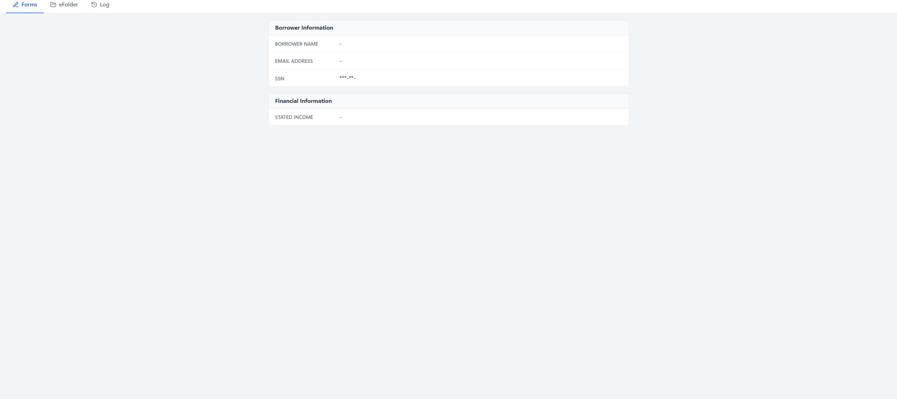
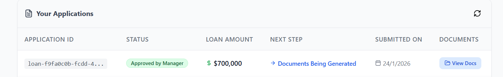

Context: The Backend is running (AI analyzes docs in logs), but the Frontend is blank (see attached images).

* Image 3: Manager Dashboard shows empty fields ("-") instead of extracted data.
* 
* Image 2: "View Docs" button on Applicant Dashboard opens a dead link.
  

## Mission 1: Fix Manager Dashboard Data (The "Blank Form" Issue)

**Target:** `backend/app/temporal/workflows/managers.py`, `backend/app/temporal/workflows/ceo.py`, `backend/app/api/routes/applications.py`, `frontend/src/pages/ManagerDashboard.jsx`

1. **Backend (The Data Source):**

   * In `LeadCaptureWorkflow` (managers.py), ensure the `run` method returns the FULL analysis object:
     `return { "recommendation": ..., "analysis": { "annual_income": 120000, "confidence": 0.9, "mismatch": False, "extracted_ssn": "..." } }`
   * Currently, it might only be returning a string or a partial object.
2. **Middle Layer (The Bridge):**

   * In `LoanLifecycleWorkflow` (ceo.py), capture this result.
   * **CRITICAL:** Update the `Application` SQL record immediately.
   * Add a side-effect or activity: `update_loan_metadata(workflow_id, new_data)`.
   * Ensure `loan_metadata` in the DB actually contains the `analysis` key.
3. **Frontend (The Display):**

   * In `ManagerDashboard.jsx`, check how it reads data.
   * It likely looks for `app.loan_metadata.applicant_info.ssn` or similar.
   * **Fix:** Update the component to read from `app.loan_metadata.analysis` (the new AI output) if the standard fields are empty.
   * Ensure the "Income Mismatch" warning logic uses `analysis.annual_income` vs `app.loan_amount`.

## Mission 2: Fix "View Docs" Link (Applicant Dashboard)

**Target:** `frontend/src/pages/ApplicantDashboard.jsx`

* **Current Behavior:** Opens `/static/loan-123/` (Directory view, often blocked/empty).
* **Desired Behavior:** Open `/static/loan-123/Initial_Disclosures.pdf`.
* **Fix:** Update the "View Docs" button `onClick` handler.
  * Check: `if (status === 'Approved') window.open(..., '_blank')`.
  * Update URL to include the specific filename `Initial_Disclosures.pdf`.

## Mission 3: Populate "Borrower Information" (Image 3)

* The screenshot shows "Borrower Name: -" and "Email: -".
* **Fix:** Ensure the API `/applications` endpoint includes `applicant_info` (Name, Email, SSN) in the root response or correctly nested in `loan_metadata`.
* Verify `ManagerDashboard.jsx` reads these specific fields correctly.

## Execution

Generate the code to:

1. Return rich data from `managers.py`.
2. Persist that data to SQL in `ceo.py` or `applications.py`.
3. Fix the data binding in `ManagerDashboard.jsx` to show the extracted values.
4. Fix the file path in `ApplicantDashboard.jsx`.
